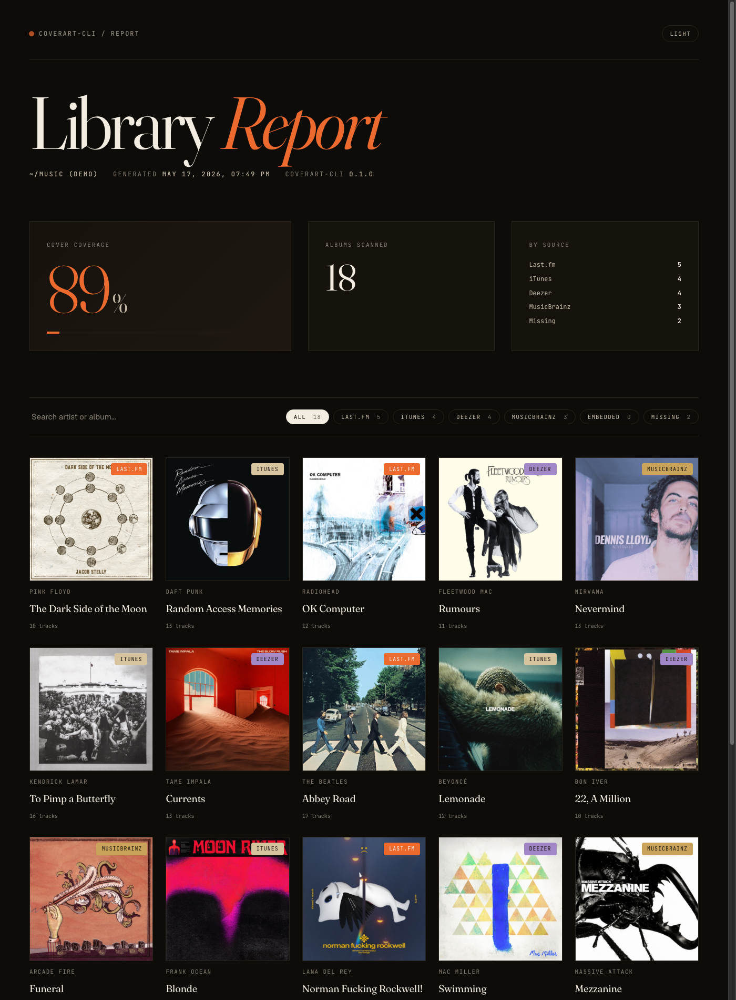

# coverart-cli

> Fill the missing covers in your music library — embed and sidecar in one pass.

<p align="center">
  
</p>

[](https://github.com/WildDragonKing/coverart-cli/actions/workflows/ci.yml)
[](https://github.com/WildDragonKing/coverart-cli/actions/workflows/codeql.yml)
[](https://coderabbit.ai)
[](https://pypi.org/project/coverart-cli/)
[](https://pypi.org/project/coverart-cli/)
[](https://www.python.org)
[](LICENSE)

## What it does

Most cover-art tools only embed _or_ only sidecar. That breaks across players —
Subsonic apps (Amperfy, Symfonium) read tags, Plex / Jellyfin prefer `cover.jpg`,
Apple Music wants embedded. `coverart-cli` does both in one pass and ships an
HTML coverage report so you can see what's still missing.

## Install

```bash
pipx install coverart-cli
```

## Use

```bash
# Fetch + embed + sidecar (free providers — no key needed)
coverart ~/Music

# Add Last.fm too (much higher hit rate)
LASTFM_API_KEY=xxx coverart ~/Music

# Just generate the coverage report
coverart ~/Music --report-only --report-html report.html

# See what would happen, change nothing
coverart ~/Music --dry-run -v
```

Run `coverart --help` for the full flag list.

## Config file

Save your defaults so you don't have to repeat flags:

```toml
# ~/.config/coverart-cli/config.toml
lastfm_key      = "your-key"
min_bytes       = 30000
replace_smaller = true
no_musicbrainz  = false
```

Lookup order (later wins): built-in → `~/.config/coverart-cli/config.toml` →
`./coverart.toml` → `--config PATH` → CLI flags → environment variables. Run
`coverart ~/Music` afterwards with no flags.

## Sources

Tried in order until a cover is found:

1. **Last.fm** — `album.getinfo` (needs a free [API key](https://www.last.fm/api/account/create))
2. **iTunes** — Apple Music's public search, no key
3. **Deezer** — public API, no key
4. **MusicBrainz** + **Cover Art Archive** — fallback for niche releases

## Supported formats

MP3 (ID3 APIC), M4A/M4B/MP4 (covr atom), FLAC (Picture block),
Ogg Vorbis / Opus (metadata_block_picture).

## Programmatic use

```python
from pathlib import Path
from coverart_cli.core import RunOptions, run
from coverart_cli.providers import ITunesProvider, DeezerProvider

stats = run(RunOptions(
    root=Path("~/Music").expanduser(),
    providers=[ITunesProvider(), DeezerProvider()],
))
print(stats.fetched_from, stats.not_found)
```

## Alternatives

| Tool                                                      | When to pick it                                                  |
| --------------------------------------------------------- | ---------------------------------------------------------------- |
| [sacad](https://github.com/desbma/sacad)                  | Best match rate; Rust binary, more sources                       |
| [get-cover-art](https://github.com/regosen/get_cover_art) | Battle-tested Python API                                         |
| [beets](https://beets.io/) `fetchart`                     | Already using beets for everything else                          |
| `coverart-cli` (this)                                     | You want the HTML report + embed/sidecar dual-output in ~700 LOC |

## Development

```bash
git clone https://github.com/WildDragonKing/coverart-cli && cd coverart-cli
python3 -m venv .venv && source .venv/bin/activate
pip install -e ".[dev]"
pytest && ruff check .
```

## Releases

Releases are fully automated via [release-please](https://github.com/googleapis/release-please-action).
Commits to `main` follow [Conventional Commits](https://www.conventionalcommits.org/):

| Commit prefix                   | Effect on next release     |
| ------------------------------- | -------------------------- |
| `feat: …`                       | minor bump (0.3.0 → 0.4.0) |
| `fix: …`                        | patch bump (0.3.0 → 0.3.1) |
| `feat!: …` / `BREAKING CHANGE:` | major bump (0.3.0 → 1.0.0) |
| `docs:`, `refactor:`, `perf:`   | changelog entry, no bump   |
| `chore:`, `ci:`, `test:`        | hidden in changelog        |

release-please opens a single rolling "Release PR" that accumulates the
pending version. Merging that PR creates the git tag, which triggers the
PyPI publish workflow.

## License

[MIT](LICENSE)
